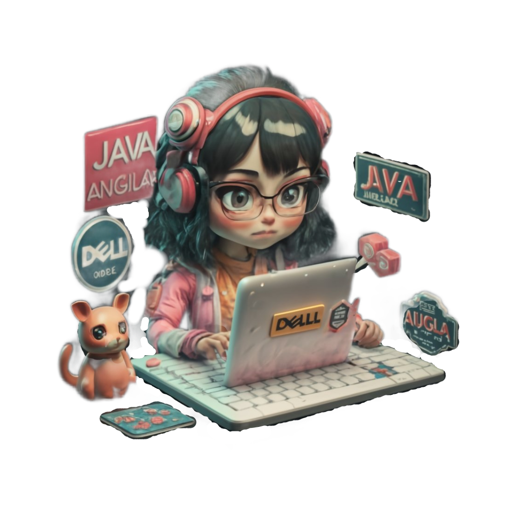

<h1 align="center">Hi 👋, I'm Nouhaila</h1>
<h3 align="center">Passionate full-stack developer with a focus on Java and Angular 💻</h3>

  

- 🔭 Currently learning at YouCode, actively engaged in hands-on learning by doing. Mastering Java, Angular, JEE, Spring, and Spring Boot. Excited to apply my knowledge to real projects!

- 🌱 Immersed in learning and working with Java, Angular, JEE, Spring, and Spring Boot. Exploring these technologies fuels my passion for crafting innovative solutions.

- 🚀 What I Do: Love building everything from the back-end to the front-end. Create RESTful APIs in Java and design dynamic user interfaces with Angular. Goal is to make scalable and efficient applications.

- 📚 Continuous Learning: In this ever-evolving tech landscape, I believe in the importance of continuous learning. Whether it's exploring new frameworks, adopting best practices, or diving into the latest industry trends, I am committed to staying ahead of the curve.

- 📫 How to reach me: [nouhailamadrani2022@gmail.com](mailto:nouhailamadrani2022@gmail.com)

<h3 align="left">Connect with me:</h3>

  

<h3 align="left">Languages and Tools:</h3>

  
  
  
  
  
  
  
  
  
  
  
  
  
  
  
  
  
  
  
  
  
  
  
  
  
  
  

